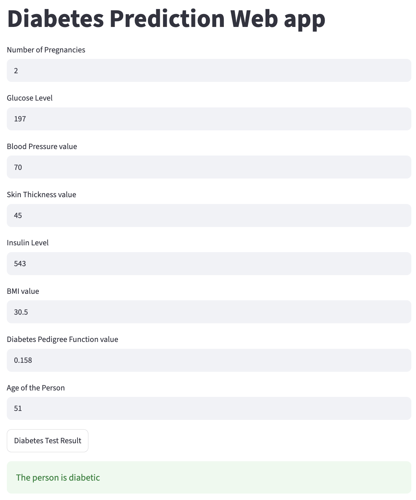

# 🩺 Diabetes Prediction (SVM)

Predict whether a person is diabetic from eight health measurements, using a **Support Vector Machine** with a linear kernel.

**🔗 Live app:** [diabetes-app.streamlit.app](https://diabetes-appgit-4m6xm28bjusw2acbeoy9hk.streamlit.app/)



> ⚠️ Educational project only. This model is trained on a small public dataset and is **not** a medical tool.

## Results

| Metric | Value |
|---|---|
| Train accuracy | 78.7% |
| Test accuracy | **77.3%** (on 154 unseen patients) |
| Baseline (always predicting "not diabetic") | 65.1% |

Train and test accuracy are close, so the model is not overfitting. It beats the simple baseline by about 12 percentage points.

## Dataset

- **Source:** [Pima Indians Diabetes Database](https://www.kaggle.com/datasets/uciml/pima-indians-diabetes-database) (National Institute of Diabetes and Digestive and Kidney Diseases)
- **Size:** 768 patients, all women of Pima Indian heritage aged 21 or older
- **Classes:** 500 non-diabetic (65%), 268 diabetic (35%)
- **Target:** 0 = not diabetic, 1 = diabetic

| Feature | Description |
|---|---|
| Pregnancies | Number of pregnancies |
| Glucose | Plasma glucose concentration (2-hour oral glucose tolerance test) |
| BloodPressure | Diastolic blood pressure (mm Hg) |
| SkinThickness | Triceps skin fold thickness (mm) |
| Insulin | 2-hour serum insulin (μU/ml) |
| BMI | Body mass index (kg/m²) |
| DiabetesPedigreeFunction | Score based on family history of diabetes |
| Age | Age in years |

## Approach

1. Loaded the data with pandas and explored it (`describe`, class counts, feature means per class). Diabetic patients have clearly higher average glucose (141 vs 110), BMI and age.
2. Separated the eight features from the `Outcome` label.
3. Standardized the features with `StandardScaler` (mean 0, standard deviation 1), since SVMs are sensitive to feature scale.
4. Split the data 80% / 20% with stratification (614 train, 154 test), so both sets keep the same diabetic / non-diabetic ratio.
5. Trained an SVM classifier with a linear kernel.
6. Evaluated accuracy on the training and test sets.
7. Built a predictive system for a single new patient.
8. Saved the model and the scaler with `pickle` and deployed them as a Streamlit web app.

## Deployment notes

- **The scaler is part of the model.** The first version of the app sent raw values to the model and gave wrong predictions, because the model was trained on standardized data. Saving the fitted `StandardScaler` and applying it in the app fixed this, so the app now gives the same results as the notebook.
- **Input handling.** Streamlit text fields return strings, so the app converts them to numbers before predicting, and shows an error message for empty or non-numeric fields.
- **Pinned versions.** scikit-learn is pinned to 1.6.1 (the Colab training version) and the app runs on Python 3.12, so the pickled model loads reliably.

## Tech stack

Python · pandas · NumPy · scikit-learn · Streamlit · Google Colab

## Project structure

```
diabetes-app/
├── app.py                        # Streamlit web app
├── diabetes_trained_model.sav    # trained SVM model
├── scaler.sav                    # fitted StandardScaler
├── requirements.txt              # dependencies
└── README.md
```

## Run locally

```bash
git clone https://github.com/Arshavir01/diabetes-app.git
cd diabetes-app
pip install -r requirements.txt
streamlit run app.py
```

## Limitations and next steps

- **Zeros used as missing values.** Some patients have 0 for glucose, blood pressure, skin thickness, insulin or BMI, which is not physically possible. Replacing these with the median would give the model cleaner data.
- **Scaler fitted before the split.** The scaler was fitted on the full dataset, so a little information from the test set leaked into training. Fitting it on the training data only (or using a scikit-learn `Pipeline`) is the correct approach.
- **Accuracy only.** With imbalanced classes, precision, recall and a confusion matrix matter more. For a screening tool, recall on diabetic patients (not missing real cases) is the key number.
- **Model comparison.** Logistic Regression, Random Forest or XGBoost, plus cross-validation and hyperparameter tuning, could improve results.
- **Small, specific dataset.** 768 patients from one population, so results may not generalize to other groups.

## Author

**Arshavir Voskanyan**
